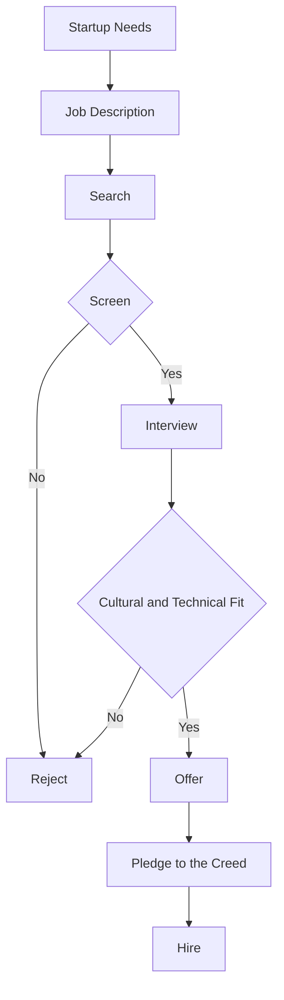

# First Draft of Hiring Flow 

```mermaid
graph TD;
A[Startup Needs] --> B[Job Description]
B --> C[Search]
C --> D{Screen}
D --> |Yes| E[Interview]
D --> |No| F[Reject]
E --> G{Cultural and Technical Fit}
G --> |Yes| H[Offer]
H --> I[Pledge to the Creed]
I --> J[Hire]
G --> |No| F
```

## Pending: Exit Flow
