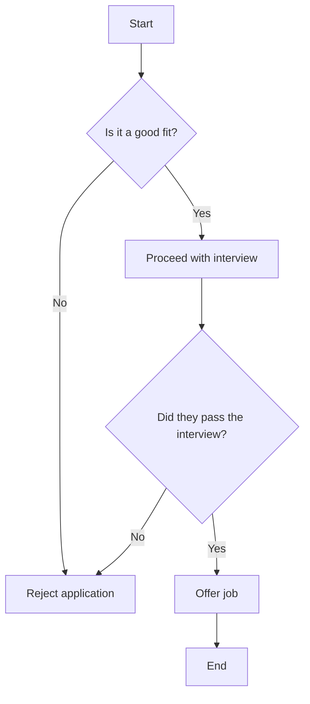

# Test 

```mermaid
graph TD;
    A[Start] --> B{Is it a good fit?};
    B -->|Yes| C[Proceed with interview];
    B -->|No| D[Reject application];
    C --> E{Did they pass the interview?};
    E -->|Yes| F[Offer job];
    E -->|No| D;
    F --> G[End];
```

