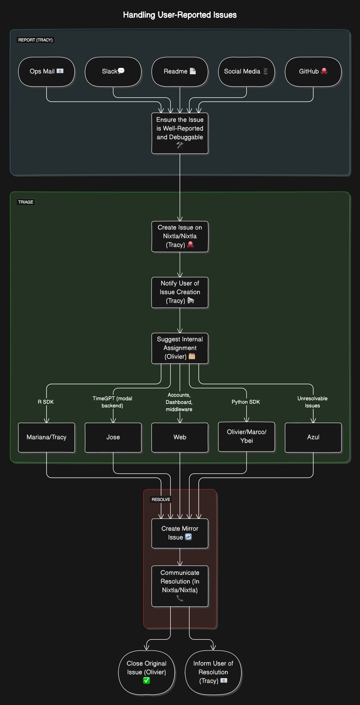

# Handling Issues, Bugs, and Errors

## 🐞 Introduction
This document outlines the process for handling user-reported issues, bugs, and errors. 

The goal is to ensure that user-reported issues are well-documented, promptly addressed, and resolved in a timely manner.

Ultimalety, all isues regadring TimeGPT and TimeGEN should be reported in the Nixtla/Nixtla repository.

## 🐛 Process
User-reported issues can originate from various sources such as Ops Mails, Slack, Readme, Social Media, and GitHub. These issues must be well-documented to facilitate debugging. Tracy is responsible for creating an issue on Nixtla/Nixtla and notifying the user of its creation. Olivier will suggest internal assignments, directing issues to the appropriate team members: Olivier, Marco, and Ybei for TimeGPT Model; Jose for TimeGPT Backend; Web for Accounts, Dashboards, and Pricing; Azul for unresolvable issues; and Mariana or Tracy for R SDK. Assigned team members will create mirror issues if necessary and work on resolving them. Once resolved, the original issue is closed, and the user is informed of the resolution.

## 🪲 Issue Handling Flow

## 🐜Modifications and Suggesions
You can use `./issues_diagram.txt` to modify the flowchart. The flowchart is created using https://app.eraser.io/. 
